# RADIATE Dataset

RADIATE (RAdar Dataset In Adverse weaThEr) is new automotive dataset created by Heriot-Watt University which includes Radar, Lidar, Stereo Camera and GPS/IMU.

We collected data in different weather scenarios (sunny, overcast, night, fog, rain and snow) to help the research community to develop new methods of vehicle perception


- [RADIATE Dataset](#radiate-dataset)
  - [Dataset size](#dataset-size)
  - [Comparison with other datasets](#comparison-with-other-datasets)
  - [Sensors](#sensors)
  - [Folder Structure and File Format](#folder-structure-and-file-format)
  - [Sensor Calibration](#sensor-calibration)
  - [Annotation Structure](#annotation-structure)
- [RADIATE SDK](#radiate-sdk)
  - [Installation](#installation)
    - [Dependencies](#dependencies)
  - [How to use](#how-to-use)
    - [Example:](#example)
  - [Vehicle Detection](#vehicle-detection)


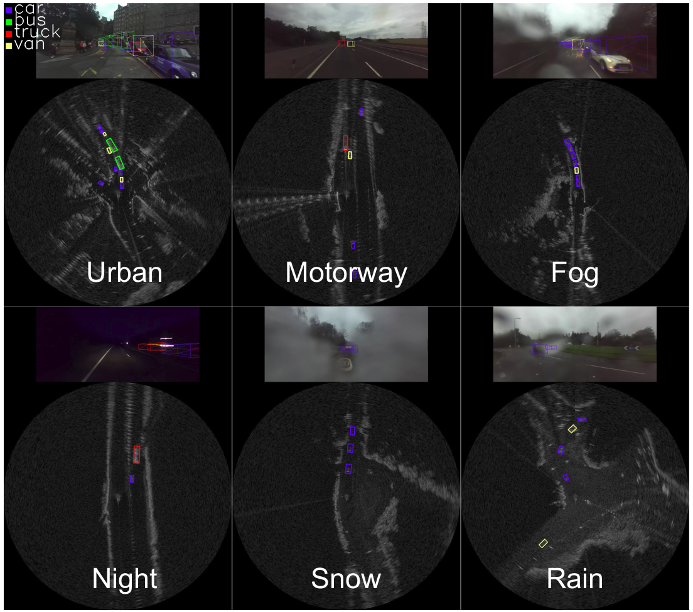


## Dataset size

We annotated the radar images in 7 different scenarios: 
Sunny (Parked), Sunny/Overcast (Urban), Overcast (Motorway), Night (Motorway), Rain (Suburban), Fog (Suburban) and Snow (Suburban). We annotated 8 different types of objects (car, van, truck, bus, motorbike, bicycle, pedestrian and group of pedestrian). Below we show a graph with the number of individual instances labelled.
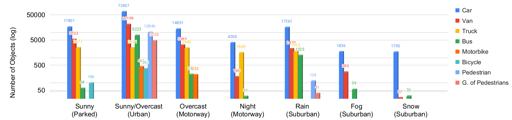

The size of each scenario can be visualised below:

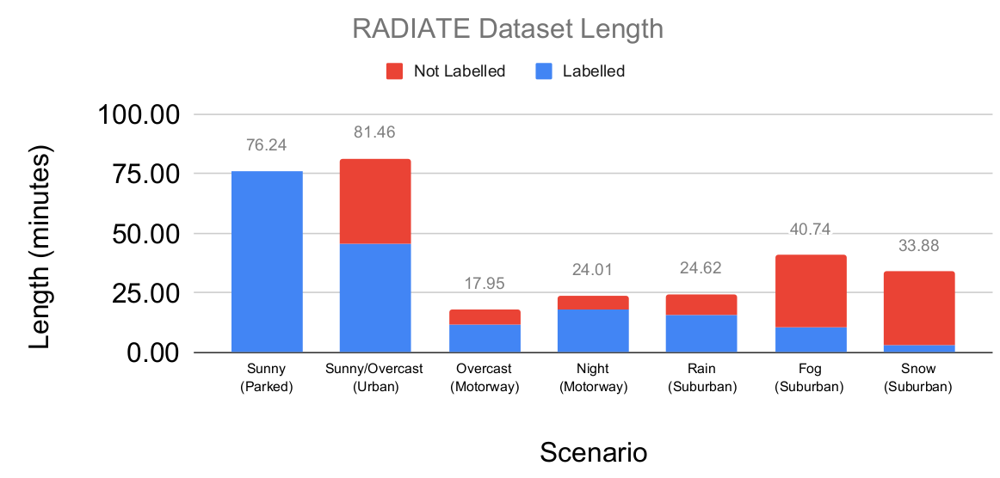

## Comparison with other datasets

RADIATE is the first public high resolution radar dataset which includes a large number of labelled road actors on public roads. It  includes  multi-modal  sensor  data  collected  in  challenging  weather  conditions,  such  as dense  fog  and  heavy  snowfall.  Camera,  LiDAR  and  GPS  data  are  also  provided  for  all sequences. The table below shows a comparison with other relevant automotive datasets with radar ([NuScenes](https://www.nuscenes.org/), [Oxford Radar RobotCar](https://ori.ox.ac.uk/oxford-radar-robotcar-dataset/), [MulRan](https://sites.google.com/view/mulran-pr/dataset) and [Astyx](https://www.astyx.com/development/astyx-hires2019-dataset.html))

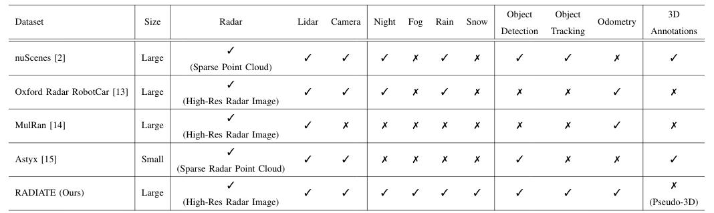


## Sensors

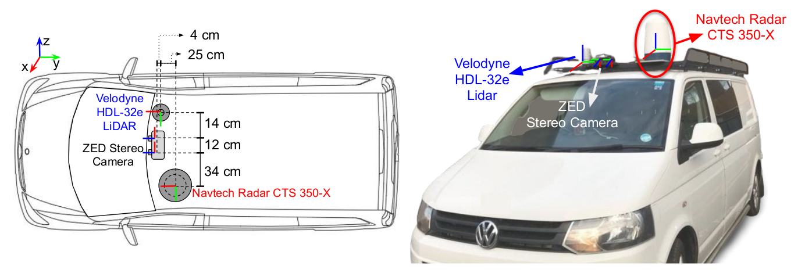

* **Stereo Camera**: An off-the-shelf ZED stereo camera is used. It is set at 672 × 376 image resolution at 15 frames per second for each camera. It is protected by a waterproof housing
for extreme weather. The images can be seriously blurred, hazy or fully blocked due to rain drops, dense fog or heavy snow, respectively.
* **LiDAR**: A 32 channel, 10Hz, Velodyne HDL-32e LiDAR is used to give 360° coverage. Since the LiDAR signal can be severely attenuated and reflected by intervening fog or snow the data can be missing, noisy and incorrect.
* **Radar** RADIATE adopts the Navtech CTS350-X radar. It is a scanning radar which provides 360° high-resolution range-azimuth images. It has 100 meters maximum operating range with 0.175m range resolution, 1.8° azimuth resolution and 1.8° elevation resolution, Currently, it does not provide Doppler information.
* **GPS/IMU** : Advanced Navigation GPS/IMU is provided. 

## Folder Structure and File Format

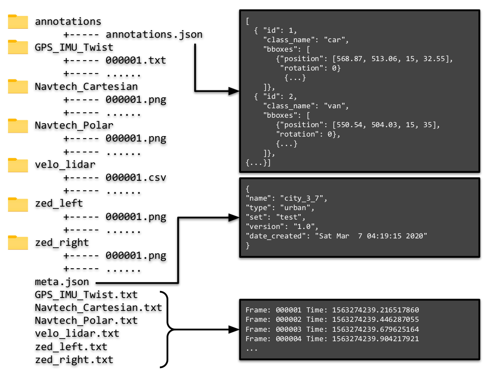

* **GPS_IMU_Twist**: We provide a readable *.txt* file. Each line is shown below:
    GPS-IMU file format:
    ```
    Line 1: Latitude, Longitude, Altitude (in degrees)
    Line [2-4]: GPS position_covariance (3x3)
    Line 5: IMU.Orientation.X IMU.Orientation.Y IMU.Orientation.Z IMU.Orientation.W (Quaternion)
    Line 6: IMU.AngularVelocity.X IMU.AngularVelocity.Y IMU.AngularVelocity.Z 
    Line 7: IMU.LinearAccelaration.X IMU.LinearAccelaration.Y IMU.LinearAccelaration.Z
    Line [8-10]: IMU.Orientation Covariance (3x3)
    Line [11-13]: IMU.AngularVelocity Covariance (3x3)
    Line [14-16]: IMU.LinearAccelaration Covariance (3x3)
    Line 17: Twist.Linear.X, Twist.Linear.Y, Twist.Linear.Z
    Line 18: Twist.Angular.X, Twist.Angular.Y, Twist.Angular.Z
    ```
    
    Example:
    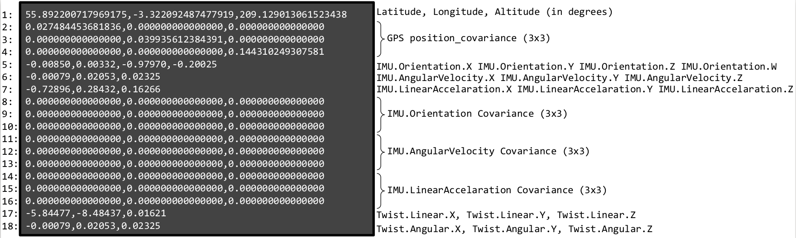

* **Navtech_Polar**: We provide *.png* with resolution 400 x 576. Where each row represents the range [0 m - 100 m] with resolution 0.17361 m. And each column represents the angle with resolution 1.1°.

    Example:
    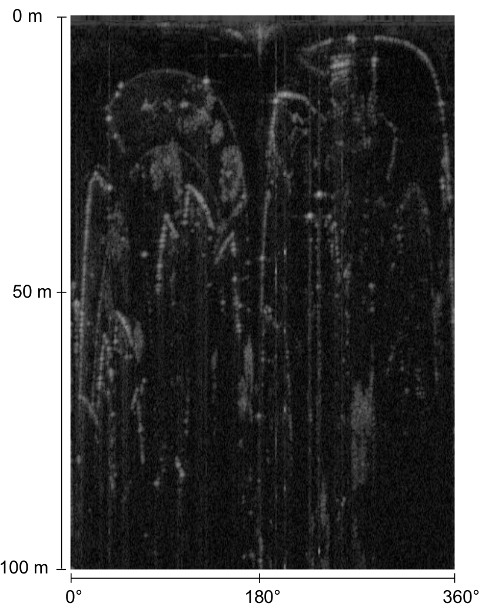

* **Navtech_Cartesian**: We provide *.png* with resolution 1152 x 1152. This is a implementation from polar to cartesian. We use nearest neighbor interpolation. The each pixel represents a 0.17361 m x 0.17361 m.

    Example:
    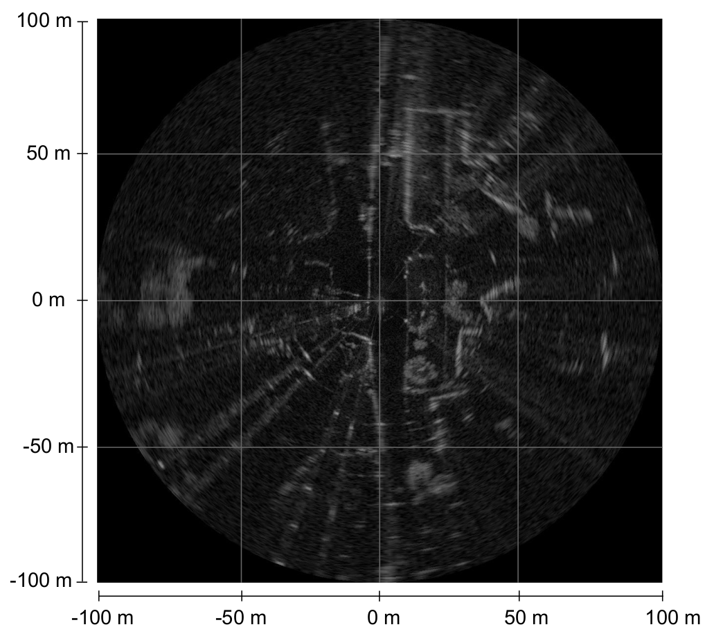
*  **velo_lidar**: We provide readable *.txt* files where each line represents `x,y,z,intensity,ring`. (x,y,z) represents the 3D point cloud in the lidar frame. Intensity [0-255] is reflectance captured by the sensor. Ring [0-31] means from each of the 32 channels the detected point came from.

    Example:
    ```
    -0.48352,-0.24456,0.01258,10,24
    -0.49561,-0.25068,0.0259,9,25
    -0.48782,-0.24673,0.038227,8,26
    -0.46912,-0.23728,0.049047,14,27
    -0.48393,-0.24477,0.063418,10,28
    -0.48104,-0.24331,-0.12773,0,13
    -0.48602,-0.24582,0.076545,9,29
    ```

*  **zed_left/right**: We provide *.png* unrectified images with resolution 672 × 376. 
  
    Example:
  
    | Left Camera | Right Camera|
    |:------:|:-------:|
    |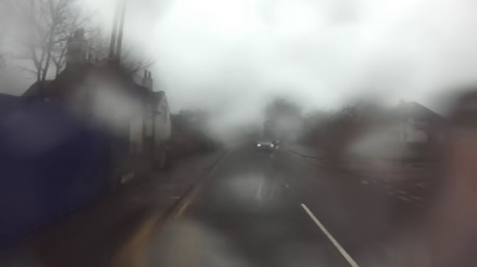|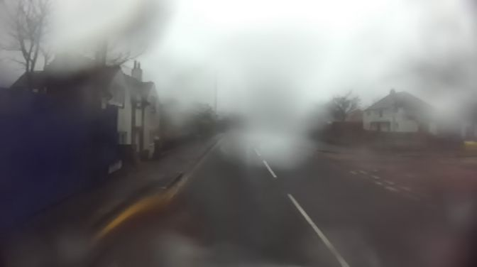|
  
* **Timestamps**: Each folder contains a `FOLDER.txt` which shows the timestamp for each collected frame. The format is:

    ```
    Frame: XXXXXX Time: XXXXXX
    ```
    
    where frame is the frame ID which correspond to the filename. Time is the timestamp using UNIX time system in seconds.

    Example:
    ```
    Frame: 000001 Time: 1574859771.744660272
    Frame: 000002 Time: 1574859771.977525228
    Frame: 000003 Time: 1574859772.213924306
    Frame: 000004 Time: 1574859772.452509138
    Frame: 000005 Time: 1574859772.696168000
    Frame: 000006 Time: 1574859772.936284528
    Frame: 000007 Time: 1574859773.185142137
    Frame: 000008 Time: 1574859773.432649521
    Frame: 000009 Time: 1574859773.684750112
    Frame: 000010 Time: 1574859773.932542386
    ```

## Sensor Calibration

Sensor calibration is required for multi-sensor fusion, feature and actor correspondence. The intrinsic parameters and distortion coefficients of the stereo camera are calibrated using the Matlab camera calibration toolbox. Then, rectified images can be generated to calculate depths. In terms of extrinsic calibration, the radar sensor is chosen as the origin of the local coordinate frame as it is the main sensor. The extrinsic parameters for the radar, camera and LiDAR are represented as 6 degree-of-freedom transformations (translation and rotation). They are performed by first explicitly measuring the distance between the sensors, and then fine-tuned by aligning measurements between each pair of sensors. The sensor calibration parameters are provided in a `config/default-calib.yaml` file. The sensors operate at different frame rates and we simply adopt each sensor data’s time of arrival as the timestamp.

The sensor calibration paremeters calculated are given below.

```
# Radar calibration parameters
radar_calib:
    T: [0.0, 0.0, 0.0]
    R: [0.0, 0.0, 0.0]

# Lidar calibration parameters
lidar_calib:
    T: [0.6003, -0.120102, 0.250012]
    R: [0.0001655, 0.000213, 0.000934]


# Left camera calibration parameters
left_cam_calib:
    T: [0.34001, -0.06988923, 0.287893]
    R: [1.278946, -0.530201, 0.000132]
    fx: 3.379191448899105e+02
    fy: 3.386957068549526e+02
    cx: 3.417366010946575e+02
    cy: 2.007359735313929e+02
    k1: -0.183879883467351
    k2: 0.0308609205858947
    k3: 0
    p1: 0
    p2: 0
    res: [672, 376]
   

# Right camera calibration parameters
right_cam_calib:
    T: [0.4593822, -0.0600343, 0.287433309324]
    R: [0.8493049332, 0.37113944, 0.000076230]
    fx: 337.873451599077
    fy: 338.530902554779
    cx: 329.137695760749
    cy: 186.166590759716
    k1: -0.181771143569008
    k2: 0.0295682692890613
    k3: 0
    p1: 0
    p2: 0
    res: [672, 376]

# Stereo calibration parameters
stereo_calib:
    TX: -120.7469
    TY: 0.1726
    TZ: 1.1592
    CV: 0.0257154
    RX: -0.0206928
    RZ: -0.000595637
    R: [[0.999983541478846,   0.000655753417350, -0.005699715684273],
        [-0.000622470939159,   0.999982758359834,   0.005839136322126],
        [0.005703446445424, -0.005835492311203,   0.9999667083098977]]
```


## Annotation Structure

The annotation is a *.json* file. where each entry of a list contains `id,class_name,bboxes`. `id` is the object identification. `class_name` is a string with the name class. `bboxes` contains `position`: `(x,y,width,height)` where `(x,y)` is the upper-left pixel locations of the bounding box, of given width and height. And `rotation` is the angle in degrees using counter-clockwise.

Example:
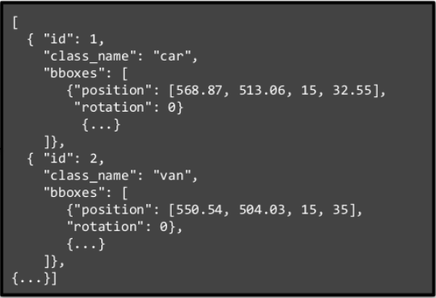

# RADIATE SDK

Software development kit (SDK) to use the RADIATE dataset. The SDK works with Python 3.7 or greater. The SDK is used for data calibration, visualisation, and pre-processing. Example below of information which can be retrieved from the SDK.

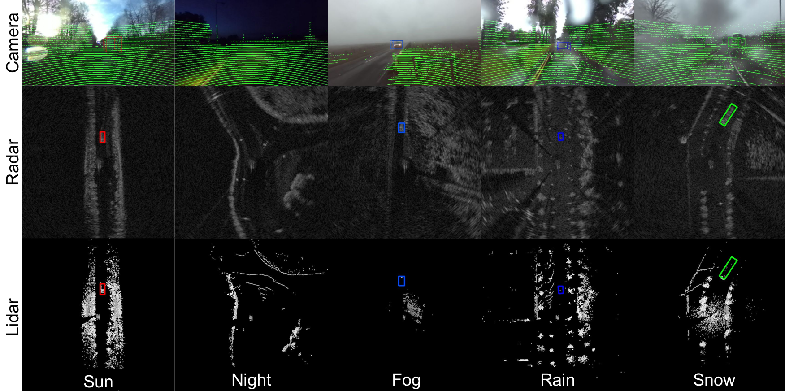

## Installation

```
git clone https://github.com/marcelsheeny/radiate_sdk.git
cd radiate_sdk
pip install -r requirements.txt
```

Run `demo.py` to visualise the dataset.

### Dependencies
```
matplotlib
opencv-python
pandas
numpy
pyyaml
```

## How to use

The file 'config/config.yaml' controls which sensors to use and configure their parameters.

- **camera_(left\right)_raw**: This is the raw (left\textbackslash right) image captured from the ZED camera with the resolution 672 x 376. For this key, we do not provide the annotation, since the calibration is based on the rectified version. We provide it to the user in case they want to apply their own rectification/calibration method.
- **camera_(left\right)_rect**: This is the rectified (left\textbackslash right) image from the calibration parameters. Since we calibrated the other sensors related to the rectified version, we provide an approximated 2D annotation. We used the distance to the ground and average height of the object to estimate the 2D bounding box. We suppose the measurement is always done in flat roads. We cannot guarantee that the bounding box projection will always occur accurately. Moreover, since the resolution of radar is low (17 cm), the annotation in the camera may not be very precise.
- **radar_polar**: It accesses the radar image in its raw polar format with resolution 400 x 576 (azimuth x range). The index 0 from the azimuth axis represents the angle '0<sup>o</sup>' and 399 represents the angle '360<sup>o</sup>'. Regarding the range axis, index 0 represents 0 meters and index 575 represents 100 meters. This raw format is provided by the sensor manufacturer after applying Fast Fourier Transform (FFT). The manufacturer converts the raw information to decibel (dB), then it is quantised to values between 0 to 255. Therefore, we do not have the raw information in Decibel or Watts. The pixel value represents the power received by the sensor. This value comes mainly from the object material and the shape.     
- **radar_cartesian**: It gives the radar image in cartesian coordinates. We provided a method in the SDK that converts the polar image to a cartesian image by projecting each point onto a (x,y) plane. After projecting each point we use bilinear interpolation to fill the holes without values. This gives an image with *1152 x 1152* image resolution.
- **radar_cartesian_pc**: This item gives the radar cartesian cfar in point cloud format as an 'np.array' with a shape (N,3), where N is the number of points and the columns are (x,y,i), where x and y are the values in meters, and *i* is the intensity power received by the sensor.
- **lidar_pc**: It gives the raw point cloud lidar information in the format (x,y,z,i,r) where x,y,z are the coordinates in meters relative to the radar sensor, 'i' is the power intensity received by the sensor. 'i' is quantised to values between 0 and 255, where it represents mostly the object material. And 'r' says from which ring of the sensor the point came from.
- **lidar_bev_image**: It gives an image with the same size as *radar_cartesian* with a bird's eye view representation. This type of image is created for researchers who want to use the lidar in a grid format and also use it together with the radar in a grid format. 
- **proj_lidar_(left\right)**: This gives the projected lidar points in a camera coordinate frame. It can be used to improve the stereo reconstruction and also fuse the information from the camera with lidar.

The file `demo.py` contains a small code which just display the annotations.

```python
import radiate
import numpy as np
import os

# path to the sequence
root_path = 'data/radiate/'
sequence_name = 'tiny_foggy'

# time (s) to retrieve next frame
dt = 0.25

# load sequence
seq = radiate.Sequence(os.path.join(root_path, sequence_name))

# play sequence
for t in np.arange(seq.init_timestamp, seq.end_timestamp, dt):
    output = seq.get_from_timestamp(t)
    seq.vis_all(output, 0)
```

In order to get the annotation values, the variable 'output' is a dictionary with the sensor and its correspondent annotation.

### Example: 

`output['sensors']['radar_cartesian']` contains a np.array with the radar image.

`output['annotations']['radar_cartesian']` contains a list of bounding boxes with `id`, `class_name` and `bbox`. `bbox` : `position` is represented as `x,y,width,height` and `bbox` : `rotation` is the angle counter-clockwise in degrees. This is exemplified below:

```
'id':1
'class_name':'bus'
'bbox':{'position': [603.5340471042896, 149.7590074419735, 26.620884098218767, 73.56976270380676], 'rotation': 177.69489304897752}
```

The documentation of all radiate methods can be seen at:
https://marcelsheeny.github.io/radiate_sdk/radiate.html

## Vehicle Detection

As first baseline, we have performed evaluation of vehicle detection from single images. We defined a vehicle as one of the following classes: car, van, truck, bus, motorbike and bicycle.

We adopted the popular Faster R-CNN [29] architecture to demonstrate the use of RADIATE for radar based object detection. Two modifications were made to the original architecture to better suit radar detection:

* Pre-defined sizes were used for anchor generation because vehicle volumes are typically well-known and radar images provide metric scales, different from camera images.
* We modified the Region Proposal Network (RPN) from Faster R-CNN to output the bounding box and a rotation angle which the bounding boxes are represented by x, y, width, height, angle.
  
To investigate the impact of weather conditions, the models were trained with the 2 different training datasets: data from only good and data from both good and bad weather. ResNet-50 and ResNet-101 were chosen as backbone models. The trained models were tested on a test set
collected from all weather conditions and driving scenarios. The metric used for evaluation was Average Precision with Intersection over Union (IoU) equal to 0.5, which is the same as the PASCAL VOC and DOTA evaluation metric.

Below we can visualise a table with the results for each scenario and the Precision Recall curve for each network trained.

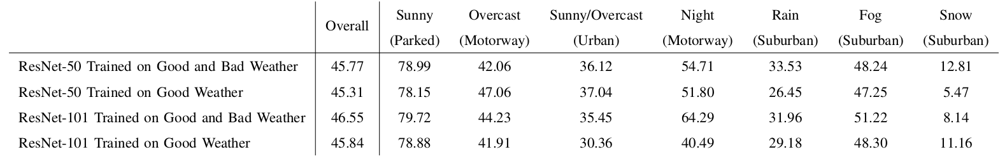


The figure bellow illustrates some qualitative results
of radar based vehicle detection in various driving scenarios and weather conditions, using Faster R-CNN ResNet-101 trained in good weather only.

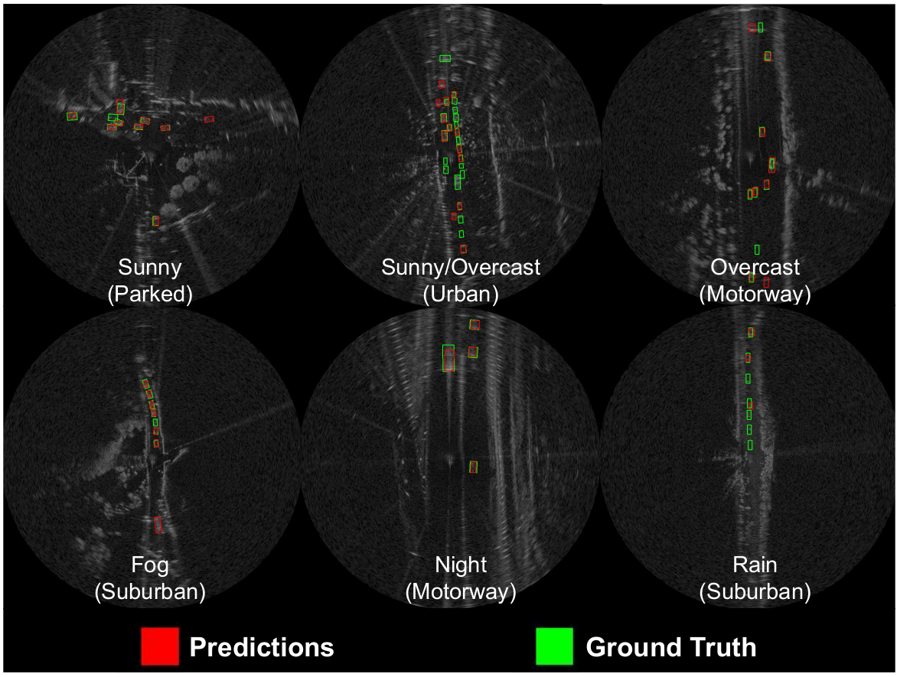

The code and the trained weights from radar based vehicle detection can be seen at [https://github.com/marcelsheeny/radiate_sdk/tree/master/vehicle_detection](https://github.com/marcelsheeny/radiate_sdk/tree/master/vehicle_detection)
